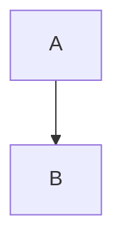

# My Postfolio Website

This is a portfolio website for an AI Engineer, built with Next.js. Live at [sujeetgund.in](https://sujeetgund.in)


## Adding or Modifying Projects

The portfolio uses a combination of a centralized data file for index pages and Markdown (MDX) files for individual project detail pages. 

To **add a new project** or **modify an existing one**, follow these two steps:

### 1. Create or Edit the MDX File
Project detail pages are generated from `.mdx` files located in `src/content/projects/`. 
To add a new project, create a new file (e.g., `my-new-project.mdx`) in this directory. 
The file must contain YAML frontmatter at the top with the project's metadata:

```yaml
---
title: "Project Title"
description: "A brief description of what the project does."
tech:
  - Python
  - Next.js
github: "https://github.com/yourusername/repo"
live: "https://your-live-demo.com"
---

## TL;DR
Your project summary here.

## Architecture
You can even include mermaid diagrams:

```

### 2. Update the Global Data Array
To ensure your project appears on the Homepage and the `/projects` listing page, you must add its metadata to the `projectsData` array in `src/lib/data.ts`.

Ensure the `slug` exactly matches your `.mdx` filename (without the extension):

```typescript
// src/lib/data.ts
export const projectsData = [
  {
    title: "Project Title",
    slug: "my-new-project", // Matches src/content/projects/my-new-project.mdx
    description: "A brief description of what the project does.",
    tech: ["Python", "Next.js"],
    github: "https://github.com/yourusername/repo",
    live: "https://your-live-demo.com",
  },
  // ... existing projects
];
```

Once both the `.mdx` file and `data.ts` are updated, your project will automatically be generated across the site.
