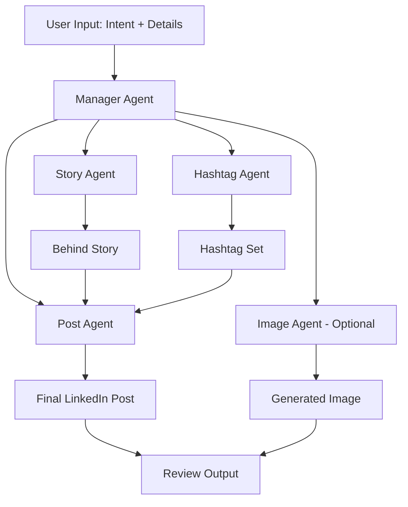

## TL;DR
I built this system to help people avoid generic AI-sounding posts and produce content that better reflects their voice, intent, and goals. A manager agent coordinates specialist sub-agents so every post feels intentional, professional, and personalized.

## Problem → Solution

**Problem**
Many AI-assisted LinkedIn posts look similar and lose personal voice. Creators need support that improves quality without flattening authenticity.

**Solution**
A Google ADK-based multi-agent workflow where each specialist handles one phase of writing, while a manager agent orchestrates the full pipeline and returns a cohesive final post.

## Workflow Phases
- Phase 1: Gather user intent and context
- Phase 2: Generate an engaging behind story
- Phase 3: Suggest relevant, discoverable hashtags
- Phase 4: Craft a complete polished LinkedIn post
- Phase 5 (optional): Generate an image prompt and asset

## Agent Design

**Manager + Specialists**
The manager agent delegates tasks to focused sub-agents for story generation, hashtag selection, final post composition, and optional image creation.

This modular setup keeps each responsibility clear, improves maintainability, and makes it easy to iterate on one stage without rewriting the entire system.

## Architecture Diagram



## Impact

**Content Quality**
The phased workflow creates clearer, more compelling posts by separating idea capture, storytelling, and final composition.

**Modular Evolution**
Individual sub-agents can be improved independently, making the system easier to maintain and extend over time.

## Quickstart

```bash
# Clone the repository
git clone https://github.com/sujeetgund/linkedin-post-generator-agent.git
cd linkedin-post-generator-agent

# Python setup
python -m venv .venv
.venv\Scripts\activate
pip install -r requirements.txt

# Configure secrets
cd linkedin_post_agent
copy .env.example .env

# Run the agent system
python -m linkedin_post_agent

# Optional: ADK web UI
adk web
```
