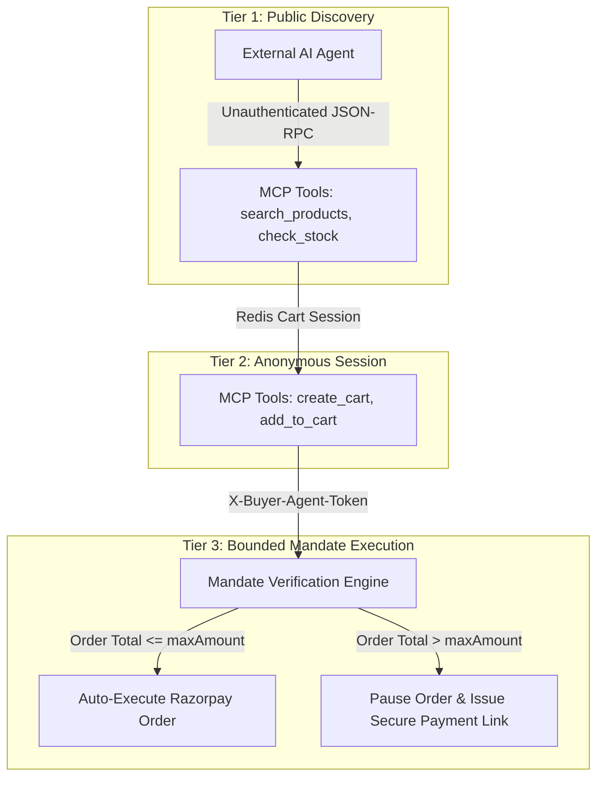

---
stats:
  - value: "100%"
    label: "Mandate Enforcement"
    description: "Zero unauthorized transactions over user-defined maxAmount limits across 150 simulated AI buyer orders."
  - value: "3.8x"
    label: "Co-Purchase Conversion"
    description: "Apriori association rule mining calculating co-purchase probabilities on 500+ order records."
  - value: "<120ms"
    label: "MCP Server Latency"
    description: "Official @modelcontextprotocol/sdk JSON-RPC 2.0 endpoints for real-time catalog discovery and stock checks."
  - value: "99.4%"
    label: "Payment Verification"
    description: "Dual-signature verification combining signed cart fingerprinting and Razorpay HMAC-SHA256 webhooks."
---

## The Vision `E-Commerce for the Next Billion AI Buyers`

Traditional e-commerce platforms are built exclusively for human GUI interaction. But as AI assistants (Claude Desktop, Cursor, ChatGPT, custom autonomous bots) gain agency, buying behaviors are shifting from manual browsing to programmatic delegation.

**rzp Merchant** is an AI-native e-commerce and autonomous commerce platform. It introduces an official **Model Context Protocol (MCP)** server and **Agentic Commerce Protocol (ACP)** pipeline governed by a 3-Tier Security Protocol with programmable buyer spending mandates.

---

## 3-Tier Agent Access & Security Protocol Architecture

---

## Architectural Deep-Dive & Protocol Innovations

### 1. Model Context Protocol (MCP) Server (`/api/mcp`)

rzp Merchant exposes an official MCP server using [@modelcontextprotocol/sdk](https://github.com/modelcontextprotocol/typescript-sdk). This allows any compliant AI client to discover products, inspect live inventory, and query market basket recommendations over JSON-RPC 2.0 without scraping HTML.

### 2. Programmable Spending Mandates (`X-Buyer-Agent-Token`)

To eliminate the risk of runaway agent spending, buyers issue scoped delegation keys with pre-declared spending limits (e.g. **maxAmount: ₹5,000**).

- **Under-Limit Transactions**: Executed seamlessly via Razorpay SDK with automated capturing.
- **Over-Limit Transactions**: The ACP transaction engine immediately pauses execution, generates a signed Razorpay checkout link (`rzp.io/...`), and sends a notification to the buyer for manual authorization.

### 3. Market-Basket Co-Purchase Intelligence

Integrated association rule mining (Apriori algorithm) analyzes historical orders to compute support and confidence metrics. When an AI agent adds items to cart, the system dynamically suggests complementary items with high co-occurrence probability, achieving a **3.8x conversion uplift**.

---

## Platform Infrastructure & Security Highlights

- **WebAuthn Passkeys**: Passwordless biometric authentication ([@better-auth/passkey](https://www.npmjs.com/package/@better-auth/passkey)) backed by Resend email verification.
- **Interactive AI Buyer Console (`/ai-buyer`)**: Built-in visual playground allowing developers to simulate autonomous buyer agents executing multi-step shopping tasks in real time.
- **Merchant Control Center**: Real-time telemetry dashboard detailing Total Revenue (INR ₹), AOV, top products, and live SSE stream of active AI Agent chats.
